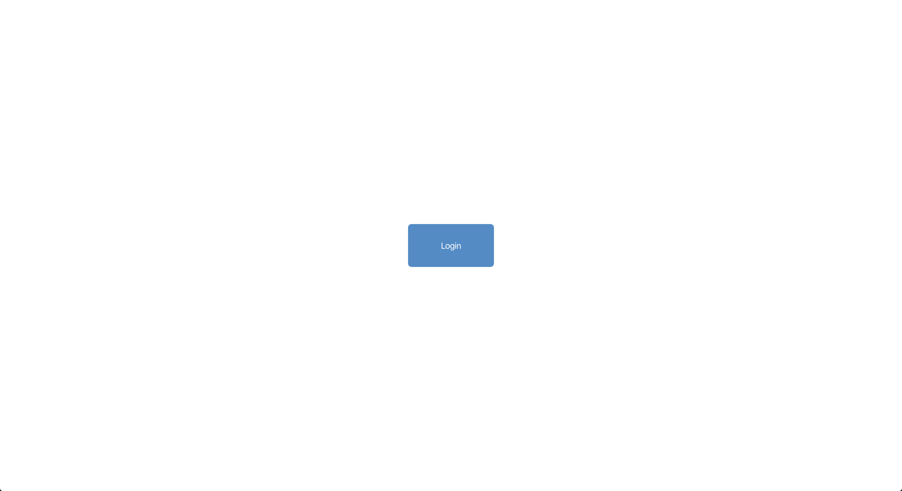
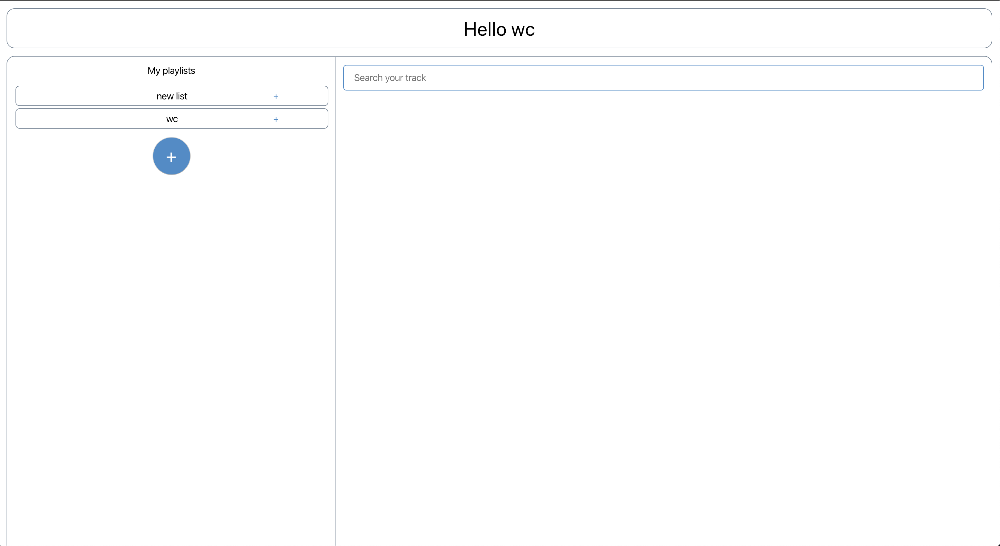
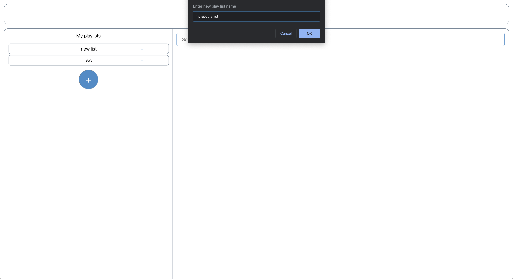
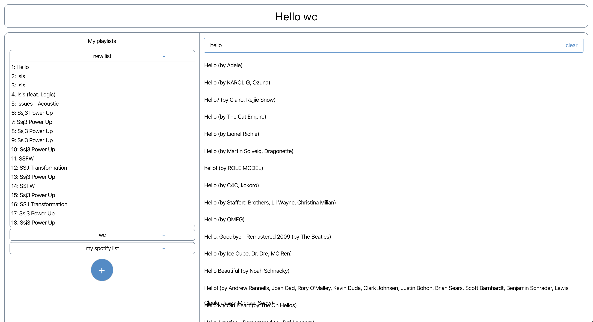
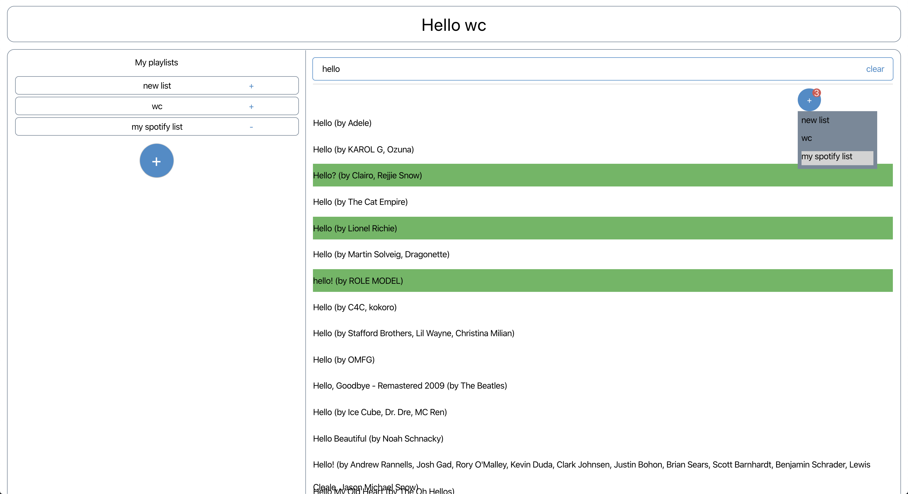
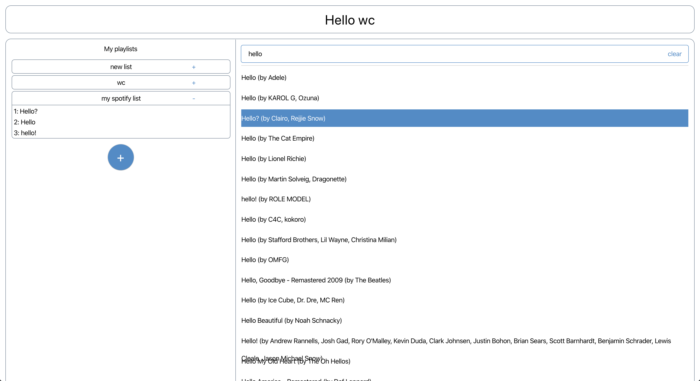

# My spotify list

My spotify list is for spotify users to

1. view their saved songs on the current play lists
2. create new play lists
3. search their favourite songs
4. add new songs to their play list

## Page flow diagram

## Screenshots and brief intro

- simple login page which features auto-authenication when the user is signed in before

- playlist page shows the user's current playlists, search bar

- you can expand/collapse a playlist

- click the '+' button on the left section to create a new play list

- new play list is created on your spotify account

- type keywords to search a song and press ENTER to search

- select one or multiple songs to add to the your play list, select the playlist on the dropdown

- the selected songs are added to the chosen playlist

## Tech Stack

- React [https://reactjs.org/](https://reactjs.org/)
- React-router [React-route](https://reacttraining.com/react-router/)
- Jest [jest](https://jestjs.io/)

## Getting Started

### Prerequisites

- Node.js

### Before start

- create environment files for different environments (development, production).
- to run this demo, you will need .env.development.local file in the root directory (attached separately).

### How to run

In the project directory, first run

`npm install`

and then you can run:

### `yarn start`

Runs the app in the development mode. 
Open [http://localhost:3000](http://localhost:3000) to view it in the browser.

The page will reload if you make edits. 
You will also see any lint errors in the console.

### `yarn test`

Launches the test runner in the interactive watch mode.
See the section about [running tests](https://facebook.github.io/create-react-app/docs/running-tests) for more information.

### what can be improved

- use [typscript](https://www.typescriptlang.org/) or at least [prop-types](https://www.npmjs.com/package/prop-types) for type checking
- complete unit tests (due to the time limits, all the important unit tests are dummied, and all the component uni tests are missing)
- implment end to end tests

## Authors

- **Chao Wang**
